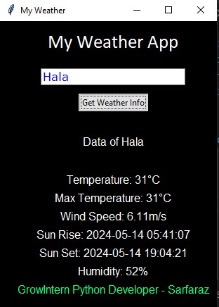
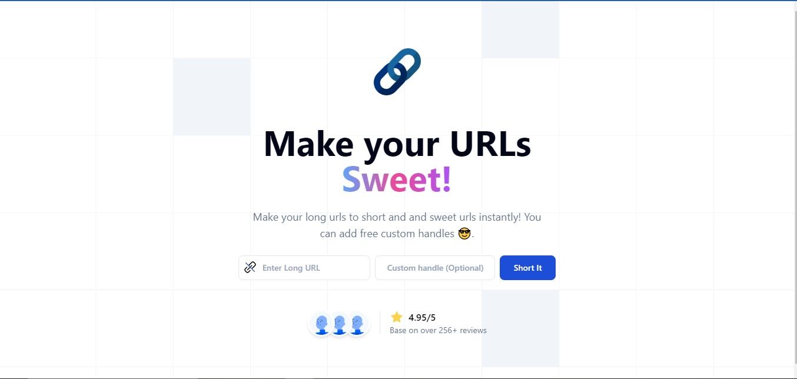
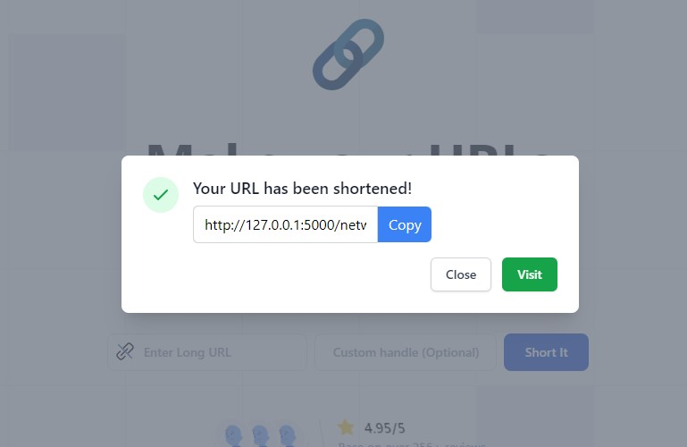

## Welcome to Repo
Here is all projects created during the internship at [GrowIntern](https://growintern.com/).

### Weather GUI App
A Weather GUI App created with Python that allows you to enter a city name and retrieve the current weather details for that location, including temperature, humidity, wind speed, and weather description.

### URL Shortner App with Flask
A URL Shortner App created with Flask that allows you to enter a URL and retrieve a shortened URL. You can specify custom handle for the shortened URL.
For Demo Watch Video: [Linkedin]([https://www.linkedin.com/posts/sarfarazunar_python-flask-projects-activity-7201105968934318081-aF9m?utm_source=share&utm_medium=member_desktop])

_More will coming soon!_
